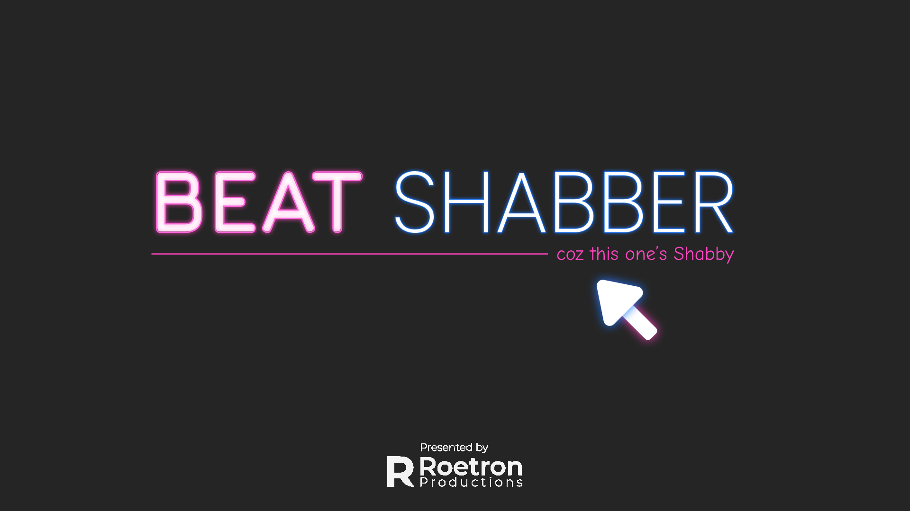

# BeatShabber

### Summary
Beat Shabber is a simplified clone version of the popular VR game Beat Saber, where you smash crates on the beats of songs. OpenCV Blob detection has been used to detect user motion and thereby move the saber across the screen. The crates are spawned as per the beats detected in the song in real time.

### Key HighLights
- OpenCV Blob detection to detect user’s motion and translate the same into the game in realtime.
- Beat recognition from Audio Source in real time to spawn the crates in random positions and orientation.
- Crate Mesh Slicing based on point of impact using Ezy-Slice.

### How to Play
For trying out the OpenCV playstyle, when you first start the game, configure the HSL sliders until the frame recognizes the color you wish to use. Ensure to have a simple background with no instances of that color elsewhere.
Hit Play, select a song and the PlayScene is started.
By default, the game is set to Mouse mode, which can be toggled with the 'M' key.
Once the song ends, you’re provided your score briefly and returned to the start menu.

### Important Mentions
Beat Shabber incorporates a number of open source projects to work properly:
- [EzySlice] : Great Unity Library for Slicing Mesh Objects
- [Unity Beat Detection] : Cool flexible System for realtime audio processing, here used for beat detection during playback.
- [OpenCV for Unity] : Awesome OpenCV asset with several examples on using OpenCV in Unity.

### Known Issues
Unaccounted memory leaks have been observed several times, all of the occurrences being linked with OpenCV runtime. I’ve tried removing instantiation of Mat, releasing the memory of each Mat after processing, and even declaring global Scalars to prevent memory hogging, but none of the steps have produced any reliable results. As I’m a newbie in OpenCV and yet to learn a lot, it’d be really great if someone skilled in OpenCV could help find and fix the code causing these memory leaks to occur.

### Test it yourself
Although I’d not suggest the OpenCV playstyle until I can reliably fix the Memory Leak issue, the game is still playable with a mouse cursor. Check the releases tab for a stable build.

### Screenshots and Clips
Home Menu
.png)

Sample Mouse Play

#### Thanks for giving me your time xD

[//]: # (These are reference links used in the body of this note and get stripped out when the markdown processor does its job. There is no need to format nicely because it shouldn't be seen. Thanks SO - http://stackoverflow.com/questions/4823468/store-comments-in-markdown-syntax)

   
   [EzySlice]: <https://github.com/DavidArayan/ezy-slice>
   [Unity Beat Detection]: <https://github.com/allanpichardo/Unity-Beat-Detection>
   [OpenCV for Unity]: <https://github.com/EnoxSoftware/OpenCVForUnity>
   
  
